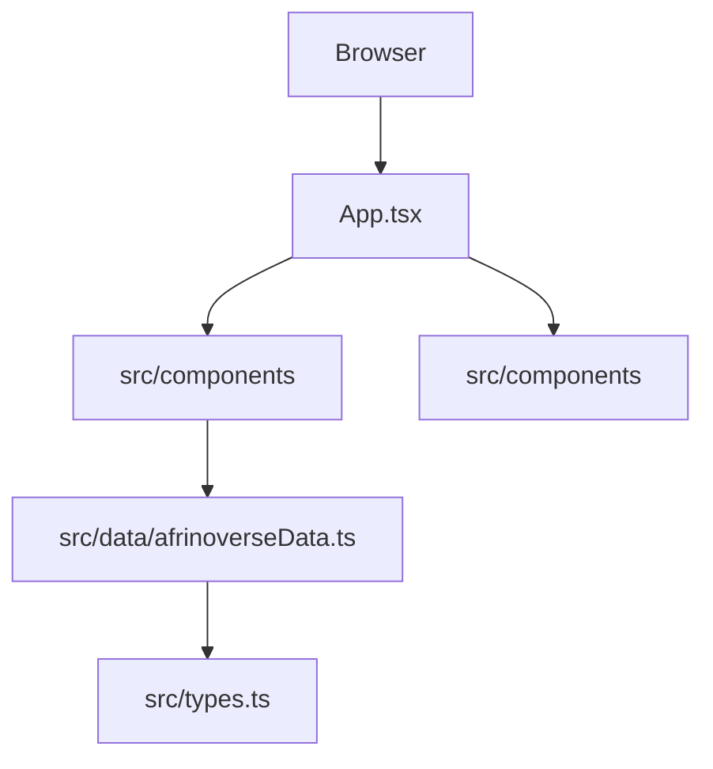

# Afrinoverse Ecosystem Launch

> The public launch site for Afrinoverse's education, product, research, and venture-building
> ecosystem.

This repository contains a responsive React single-page application that presents the Afrinoverse
ecosystem, products, partner pathways, and legal information. It is a client-only Vite application;
there is currently no backend, database, authentication, or secret runtime configuration.

## Key features

- Overview of Afrinoverse's six ecosystem engines
- Product showcases for FairwayPro, StitchPro, and Digital ToolPro
- Innovation lab and venture-incubation journey
- Audience-specific partnership calls to action
- Interactive product, partnership, privacy, and terms modals
- Responsive animated interface built with Motion and Tailwind CSS

## Technology stack

| Category   | Technology               | Usage                                    |
| ---------- | ------------------------ | ---------------------------------------- |
| Runtime    | Node.js 20.19+           | Local tooling and builds                 |
| Framework  | React 19                 | User interface                           |
| Build tool | Vite 6                   | Development server and production bundle |
| Language   | TypeScript 5.8           | Static typing                            |
| Styling    | Tailwind CSS 4           | Utility-first styling and theme tokens   |
| Testing    | Vitest + Testing Library | Component tests                          |

## Getting started

### Prerequisites

- Node.js 20.19 or newer
- npm 10 or newer

### Installation

```bash
git clone git@github.com:tolukusan/afrinoverse-ecosystem-launch.git
cd afrinoverse-ecosystem-launch
npm ci
npm run dev
```

Open <http://localhost:3000>.

The current site requires no environment variables. If browser configuration is added later, expose
only non-secret values with Vite's `VITE_` prefix and document them in `.env.example`.

## Commands

| Command                | Purpose                                              |
| ---------------------- | ---------------------------------------------------- |
| `npm run dev`          | Start the development server on port 3000            |
| `npm run test`         | Run the test suite once                              |
| `npm run test:watch`   | Run tests in watch mode                              |
| `npm run lint`         | Run ESLint with zero warnings allowed                |
| `npm run format:check` | Verify Prettier formatting                           |
| `npm run typecheck`    | Run TypeScript without emitting files                |
| `npm run build`        | Create the production bundle in `dist/`              |
| `npm run check`        | Run every required local quality gate                |
| `npm run security:cve` | Audit dependencies for high-severity vulnerabilities |

## Architecture

The application is a component-based static frontend. `App.tsx` owns modal and selection state,
section components render the page, and typed content is centralized in `src/data`.



See [the architecture overview](docs/architecture/overview.md) for boundaries and data flow.

## Quality and security

Run the complete local gate before opening a pull request:

```bash
npm run check
npm run security:cve
```

Do not put credentials in client code or `VITE_` variables; Vite embeds those values into the
browser bundle. Report vulnerabilities through GitHub's private vulnerability reporting flow as
described in [.github/SECURITY.md](.github/SECURITY.md).

## Contributing

Read [.github/CONTRIBUTING.md](.github/CONTRIBUTING.md) and the repository-specific
[AGENTS.md](AGENTS.md) before making changes.

## Deployment

`npm run build` creates a static site in `dist/`. Configure the hosting platform to serve
`index.html` as the fallback for browser navigation and deploy only the generated `dist/` output.

## License

No repository-wide license has been declared. The existing source-file notices remain authoritative.
