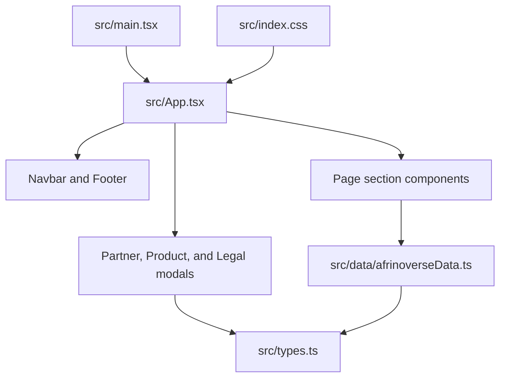

# Architecture overview

## Purpose

Afrinoverse Ecosystem Launch is a static, client-rendered marketing site. It communicates the
organization's ecosystem and collects partnership intent in the browser. It currently has no server,
database, authentication boundary, or external API integration.

## Component model

`src/main.tsx` mounts the application. `src/App.tsx` composes the page and owns state shared across
sections: the selected product, partnership track, and open modal. Individual sections own local
presentation state. Repeated content lives in `src/data` and follows interfaces in `src/types.ts`.

## Runtime data flow

1. Vite produces static HTML, JavaScript, CSS, and asset files.
2. The browser mounts `App` and renders each section from local typed data.
3. Calls to action update state in `App`, which opens the relevant modal.
4. No content or form data is currently persisted or sent to a remote service.

## Security boundaries

Everything shipped by Vite is public. Source code, static content, and `VITE_` environment values
must never contain credentials or private configuration. If partnership submissions later cross a
network boundary, introduce a documented server endpoint with validation, abuse protection, privacy
handling, explicit failure states, and tests before connecting the UI.

External product images are loaded from Google-hosted URLs. Their availability and privacy behaviour
are outside this repository's control; move them into `public/` if deterministic hosting is
required.

## Change placement

| Change                                | Primary location              |
| ------------------------------------- | ----------------------------- |
| Page structure or shared modal state  | `src/App.tsx`                 |
| A section's layout or interaction     | `src/components/`             |
| Repeated marketing or product content | `src/data/afrinoverseData.ts` |
| Shared data contracts                 | `src/types.ts`                |
| Theme tokens and global styling       | `src/index.css`               |
| Build and development behaviour       | `vite.config.ts`              |

Keep additions within these boundaries until a concrete requirement justifies a new layer.
